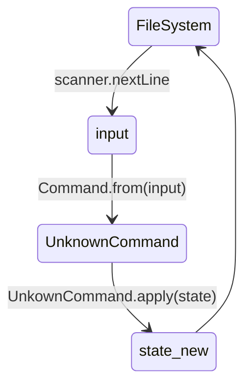

FileSystem通过scanner.nextLine读取命令行---input，然后调用Command.from(input)返回适配的Command。这里的Command就是Singleton Object,这里调用它的from method。目前返回的都是UnknownCommand。然后UnkownCommand.apply(state)来处理命令并返回一个新的state，目前只是打印dummy message。最后接着FileSystem的scanner.nextLine

